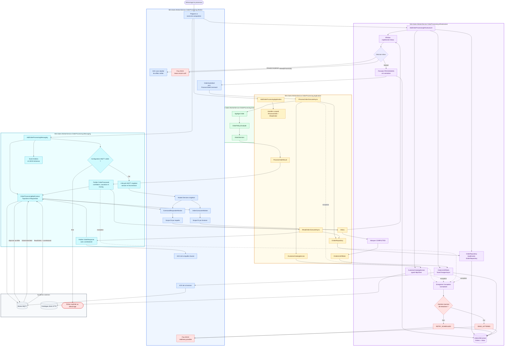

# Documentation du template Worker Service MQTT

Ce portail documente l’implémentation de référence
`Mint.Sales.WorkerService.OrderProcessing`. Il complète l’architecture générale en expliquant le
rôle de chaque projet, la composition du conteneur, les adaptateurs et le cycle complet d’une
livraison MQTT.

## Parcours recommandé

1. [Vue d’ensemble et dépendances](01-overview.md)
2. [Composition et cycle d’injection de dépendances](02-dependency-injection.md)
3. [Projet Domain](03-domain.md)
4. [Projet Application](04-application.md)
5. [Projet Messaging](05-messaging.md)
6. [Projet Infrastructure et adaptateurs](06-infrastructure.md)
7. [Projet Worker et cycle d’un message](07-worker-runtime.md)
8. [Inbox, idempotence et unité de travail](08-inbox-idempotence.md)
9. [Configuration et environnements](09-configuration.md)
10. [Stratégie de tests](10-testing.md)
11. [Industrialisation avec `dotnet new`](11-template-usage.md)
12. [Conteneurisation avec Docker et Compose](12-containers.md)

## Carte rapide des projets

| Projet | Rôle | Références autorisées |
|---|---|---|
| `Domain` | Entités, Value Objects et règles métier pures | Aucune couche applicative |
| `Application` | Cas d’utilisation et ports nécessaires | `Domain` |
| `Messaging` | Event Entities, schemas, topics et contexte MQTT | `Net.Mqtt.Infrastructure` |
| `Infrastructure` | EF Core, inbox, repositories et services HTTP | `Application`, `Domain` |
| `Worker` | Composition et adaptation MQTT vers Application | `Application`, `Messaging`, `Infrastructure` |
| `*.Tests` | Vérification par niveau | Seulement les projets testés et leurs dépendances nécessaires |

## Flux complet du template

Le flux principal garantit que les effets métier et l’état `COMPLETED` sont validés avant l’ACK.
La publication MQTT ne partage pas la transaction EF Core ; lorsque sa garantie atomique est requise,
compléter ce flux avec l’outbox décrite dans [Inbox, idempotence et unité de travail](08-inbox-idempotence.md).

## Règle de lecture

Les noms `Order`, `Customer` et `Sales` forment un exemple applicatif. Lors de la génération d’un
service, remplacer le vocabulaire métier, mais conserver les frontières, lifetimes et directions de
dépendances décrits dans ces pages.

Voir également [l’architecture Worker Service générale](../../Documentation/workerservice-architecture.md)
et [le README exécutable du template](../Mint.Sales.WorkerService.OrderProcessing/README.md).
